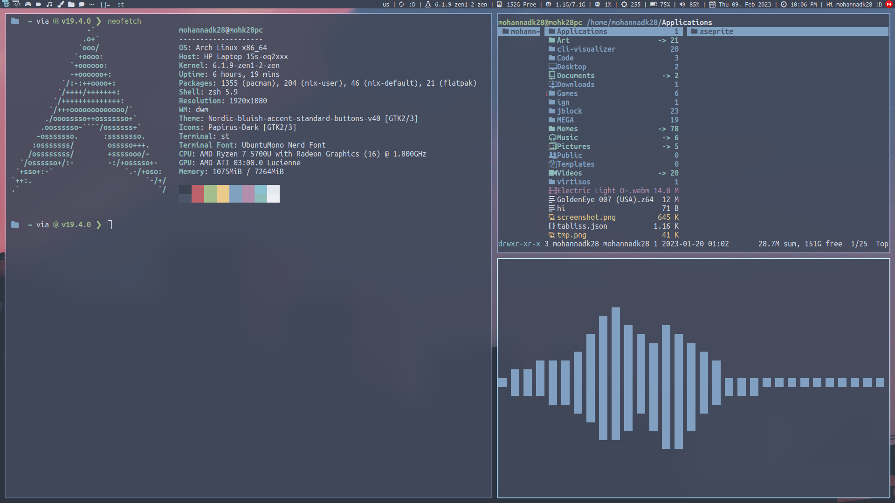

# dwm-pixelfiles

My DWM Build for pixelfiles :D

---

## Patches
1. [activetagindicatorbar](https://dwm.suckless.org/patches/activetagindicatorbar/)
2. [Alt-tab](https://dwm.suckless.org/patches/alt-tab/)
3. [autostart](https://dwm.suckless.org/patches/autostart/)
4. [columns](https://dwm.suckless.org/patches/columns/)
5. [fullgaps](https://dwm.suckless.org/patches/fullgaps/)
6. [fullscreen](https://dwm.suckless.org/patches/fullscreen/)
7. [shiftview](https://lists.suckless.org/dev/1104/7590.html)
8. [systray](https://dwm.suckless.org/patches/systray/)
